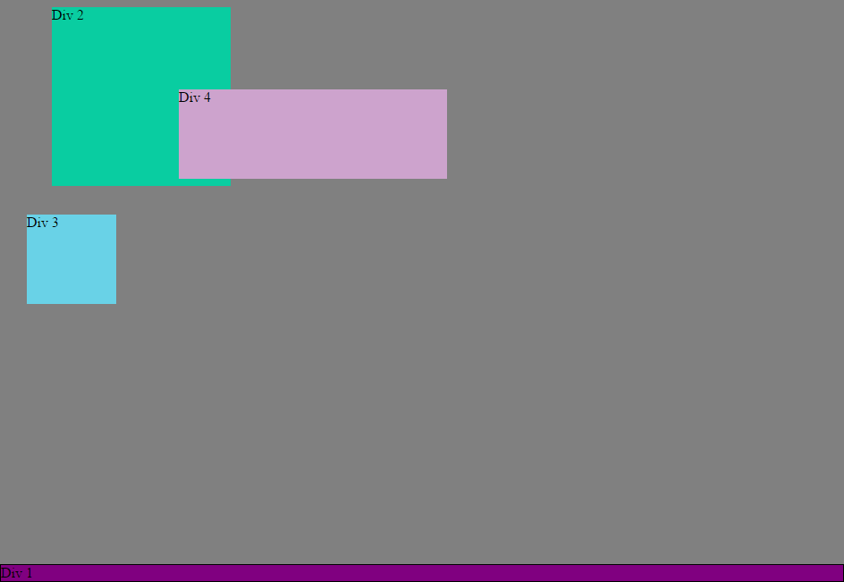

#####How can you use Chrome's DevTools inspector to help you format or position elements?

You may edit the css in browser and observe what the changes do.

#####How can you resize elements on the DOM using CSS?

using width and height.

#####What are the differences between Absolute, Fixed, Static, and Relative positioning? Which did you find easiest to use? Which was most difficult?

*Static is the default positioning value and uses margins for positioning and a static element will effect other elements. This one is probably the easiest.

*Absolute is the elements position relative to its parent. Margin is ignored, while top, left, right, and bottom are used.

*Fixed is like absolute except that the element will stay fixed to the window, so if you scroll down it will stay in its same position relative to the window.

*Relative is the position relative to where it would be without any other css input. This one also ignores margin in favor of left, right, top, bottom. This one is probably the most difficult.

#####What are the differences between Margin, Border, and Padding?

In the simple terms, border is the outline of the rectangle that is your element, margin is the extra distance outside of the border, and padding is the distance from the border to the content.

#####What was your impression of this challenge overall? (love, hate, and why?)

I think it was good, it is useful for practicing working on existing code.