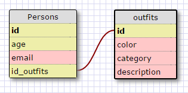

1. SELECT * FROM regions;

2. SELECT state_name, population FROM states;

3. SELECT state_name, population FROM states ORDER BY population DESC;

4. SELECT state_name FROM states WHERE region_id=7;

5. SELECT state_name, population_density FROM states WHERE population_density>50 ORDER BY population_density ASC;

6. SELECT state_name FROM states WHERE population BETWEEN 1000000 AND 1500000;

7. SELECT state_name, region_id FROM states ORDER BY region_id ASC;

8. SELECT region_name FROM regions WHERE region_name LIKE '%Central%';

9. SELECT regions.region_name, states.state_name FROM regions INNER JOIN states ON regions.id = states.region_id;

#####What are databases for?
Databases are for storing information in an organized fashion, which are to be retrived later.

#####What is a one-to-many relationship?
A one-to-many relationship is where the row of one table can have a connection to many different rows of another table.

#####What is a primary key? What is a foreign key? How can you determine which is which?
A primary key is a unique identifier for a record in a table, while a foreign key is a field that is a primary key in another table. There can only be 1 primary key per table, and it will normally be the id for that table, while a foreign key will be the primary key to another table.

#####How can you select information out of a SQL database? What are some general guidelines for that?
using the SELECT keyword. General guidelines are that clauses and keywords are ALL CAPS, table names should be pluralized, use snake_cases, each row has an auto-incrementing integer called id.
