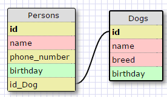
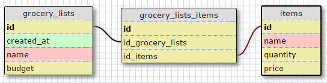

This is a one to one schema because each person can only have 1 dog_id, which would only mean one dog. Say if it were for a competition or something.

This is a many to many schema because each list can have multiple items and each item can belong to multiple lists.

#####What is a one-to-one database?
A one to one database is where one row in a table can have one row in another table. For instance, if I had a table of grooms and a table of brides, each each groom can have only one bride and vise versa (in a monogamous society).

#####When would you use a one-to-one database? (Think generally, not in terms of the example you created).
You would use a one to one database when something can only have one of something else.

#####What is a many-to-many database?
A many to many database is where many rows in a table can have many rows in another table. For instance, if I had a table of people and a table of pets, each person could have more than one pet and each pet could belong to more than one person (in the case of a family or something).

#####When would you use a many-to-many database? (Think generally, not in terms of the example you created).
You would use a many to many database when multiples of one thing could have multiples of another thing.

#####What is confusing about database schemas? What makes sense?
Sometimes it is confusing to determine the primary and foreign keys. What makes sense is determining a relationship between tables.
